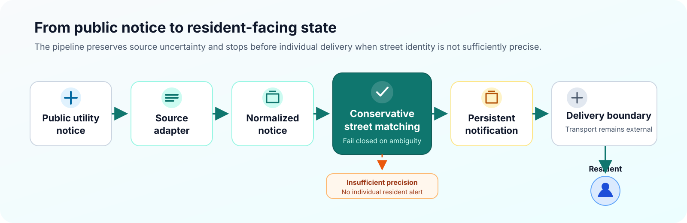
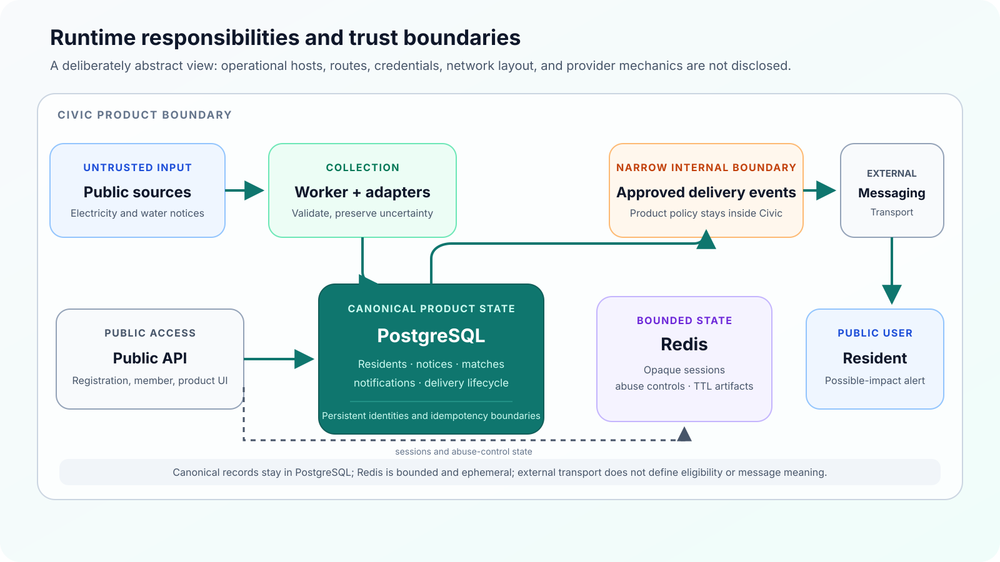
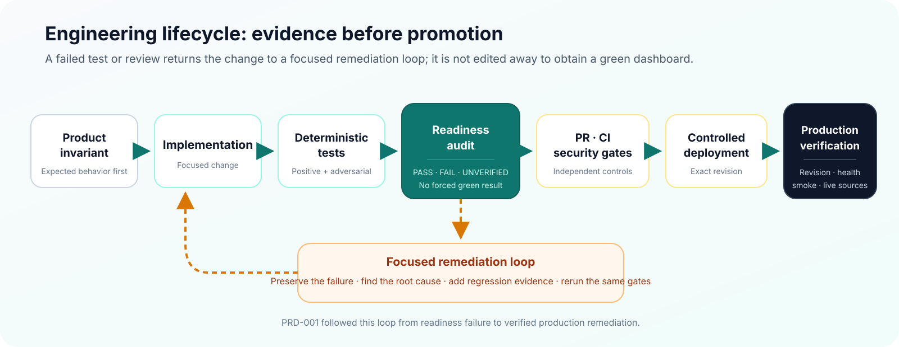

# Civic Utility Monitor

**A production civic-tech system that monitors public electricity and water-service notices and helps residents identify interruptions that may affect their registered street.**

[Open the live product](https://monitorcomunitario.soberania.cloud) · [Product](PRODUCT.md) · [Architecture](ARCHITECTURE.md) · [Engineering evidence](ENGINEERING_EVIDENCE.md) · [AI-assisted development](AI_ASSISTED_DEVELOPMENT.md)

> **Public technical case study.** The canonical production repository is private. This repository shares the product model, architecture, engineering decisions, and selected verification evidence without publishing provider-specific acquisition mechanics, operational infrastructure, or production source code.

## Verified product status

| Area | Current evidence |
| --- | --- |
| Deployment | Exact production revision verified during controlled release |
| Supported public sources | Celesc scheduled outages, Celesc emergency outages, and CASAN service notices in Santa Catarina, Brazil |
| Public experience | Brazilian Portuguese, English, and Spanish |
| Production smoke | 9/9 read-only checks passed after deployment |
| Matching policy | Individual alerts require sufficiently specific, conservative street equivalence |
| Resident communication | Deterministic application rules; no autonomous LLM decision decides who receives an alert |

Civic is independent from Celesc and CASAN. It complements official channels; it does not replace them, access private utility accounts, or confirm the status of a specific consumer unit.

## The problem

Public interruption notices can be useful but still fail to reach everyone living at an affected address. Official notification channels are commonly associated with the utility account holder, while tenants, relatives, staff, and other occupants may not control that account.

Civic adds an independent monitoring layer over public information. A resident voluntarily registers an address and alert preferences. The system then evaluates whether a supported public notice contains enough location detail to indicate a **possible impact** on the registered street.

No utility-account credentials are required.

## How the product works



1. Source-specific adapters collect supported public notices.
2. Provider-shaped records become a common notice model without inventing missing precision.
3. Resident preferences and municipality context narrow the candidate set.
4. Conservative street comparison decides whether an individual alert is eligible.
5. Matches, notifications, and delivery state are persisted before transport.
6. An external delivery boundary handles transport without defining product semantics.

## My role

I led the product and engineering work across:

- problem framing and product boundaries;
- application and persistence architecture;
- public-source integration;
- matching and notification policy;
- resident, administrative, and delivery workflows;
- automated testing and security hardening;
- Git/GitHub workflow, controlled deployment, and production verification;
- AI-assisted implementation, audit, and remediation under explicit evidence gates.

## Three engineering challenges

### 1. Precision over aggressive matching

The system is not allowed to turn a broad municipality or neighborhood notice into an individual resident alert. Even at street level, high textual similarity is not sufficient when the remaining words change the street's identity.

The product therefore fails closed: uncertain location data may remain stored and observable, but it does not become an individual alert.

### 2. Repeated work without repeated resident impact

Collection and delivery systems retry. Workers restart. Sources repeat records. Civic persists stable identities and lifecycle state so repeated execution can be tested without producing duplicate notices, matches, notifications, or delivery events.

### 3. Unstable external inputs behind stable product rules

Each public source has its own structure and precision. Those differences stay inside source-specific adapters. The rest of the product works with a normalized notice model and preserves missing or uncertain fields instead of fabricating detail.

## Engineering case: when a score of 100 was unsafe

A dedicated readiness suite found a release-blocking false positive using fictitious streets:

| Registered street | Published street | Required result |
| --- | --- | --- |
| `Rua das Flores` | `Rua das Flores do Sul` | No individual match |

A generic token-set similarity function treated the shorter street as a complete subset of the longer one and produced a perfect score. The test demonstrated that a numerically strong fuzzy result could still violate the product invariant.

The remediation did not special-case those street names or merely change a threshold. Street eligibility moved to canonical, fail-closed equivalence: representational differences such as abbreviations, accents, case, punctuation, and spacing may normalize; meaningful remaining differences do not authorize an alert. Similarity remains useful as audit metadata, not as permission to contact a resident.

The complete engineering loop was:

```text
product invariant
→ readiness suite exposes false positive
→ root cause analysis
→ positive and negative regression matrix
→ general remediation
→ fault-sensitivity check
→ full certification
→ PR and security gates
→ controlled deployment
→ exact production revision verification
```

The implementation, thresholds, provider mechanics, and complete matching corpus remain private. The evidence and decision process are documented in [Engineering evidence](ENGINEERING_EVIDENCE.md).

## Verification evidence

Evidence is deliberately qualified by the revision and environment in which it was produced.

| Layer | Evidence |
| --- | --- |
| Certification suite | 367 collected; 353 passed; 14 explicit opt-in checks skipped in the ordinary run |
| Browser readiness | 12 Chromium checks passed at the matching-remediation certification |
| PostgreSQL and Redis | Disposable integration and contract runs passed |
| Matching safety | Positive normalization matrix, adversarial negative matrix, end-to-end suppression, and fault-sensitivity validation |
| Public-content release | 354 passed with 14 explicit opt-in skips; separate browser/i18n checks passed |
| Production | Exact deployed revision proven; public API, internal API, worker, PostgreSQL, and Redis healthy |
| Production smoke | 9/9 read-only checks passed |
| Live-source compatibility | Celesc scheduled, Celesc emergency, and CASAN checks passed |
| Security gates | Ruff, Mypy, Bandit, pip-audit, Gitleaks, repository hygiene, container, and integration checks |

These results do **not** claim uptime, traffic scale, an SLA, guaranteed source completeness, guaranteed message delivery, a security certification, or formal legal approval.

## Architecture at a glance



The architecture separates public access, source collection, canonical persistence, bounded ephemeral state, and the internal delivery boundary. PostgreSQL owns product records; Redis supports sessions, abuse controls, and other time-bounded state. External messaging remains outside the product's credential boundary.

Read [Architecture](ARCHITECTURE.md) for the decisions and trade-offs.

## Technology

Python 3.12, FastAPI, SQLAlchemy, Alembic, PostgreSQL, Redis, Playwright, HTTPX, APScheduler, Docker, Pytest, Ruff, Mypy, Bandit, pip-audit, Gitleaks, and GitHub Actions.

## Engineering process



The repository workflow used scoped branches, automated validation, explicit readiness reviews, pull requests, security gates, controlled deployment, and post-deploy verification. Failed checks were treated as evidence to investigate, not obstacles to edit away.

Read [Engineering evidence](ENGINEERING_EVIDENCE.md) for the validation layers and release chain.

## AI-assisted development

AI assistance supported repository analysis, research, implementation, test construction, documentation, and audit preparation. It did not replace product invariants, diff review, automated tests, CI/security controls, or production verification.

Most importantly, Civic does not use an LLM to decide whether a resident should receive an alert. Matching and resident-facing notification policy are deterministic.

Read [AI-assisted development](AI_ASSISTED_DEVELOPMENT.md).

## Product boundaries

Civic currently:

- supports selected public utility sources in Santa Catarina;
- uses textual street identity rather than geospatial intersection;
- depends on the precision and availability of public provider information;
- describes possible impact, not confirmed private-account status;
- keeps provider transport and official service confirmation outside its scope.

Read [Product](PRODUCT.md) for the full product model and limitations.

## Repository disclosure

This repository is a curated case study, not the canonical product source and not an open-source release. It intentionally omits:

- provider acquisition and parser mechanics;
- exact matching implementation and complete test corpus;
- internal delivery routes, credentials, and callback behavior;
- host, proxy, backup, filesystem, and environment details;
- operational logs, snapshots, resident data, and unreleased roadmap material.

No reuse license has been added to this repository.
